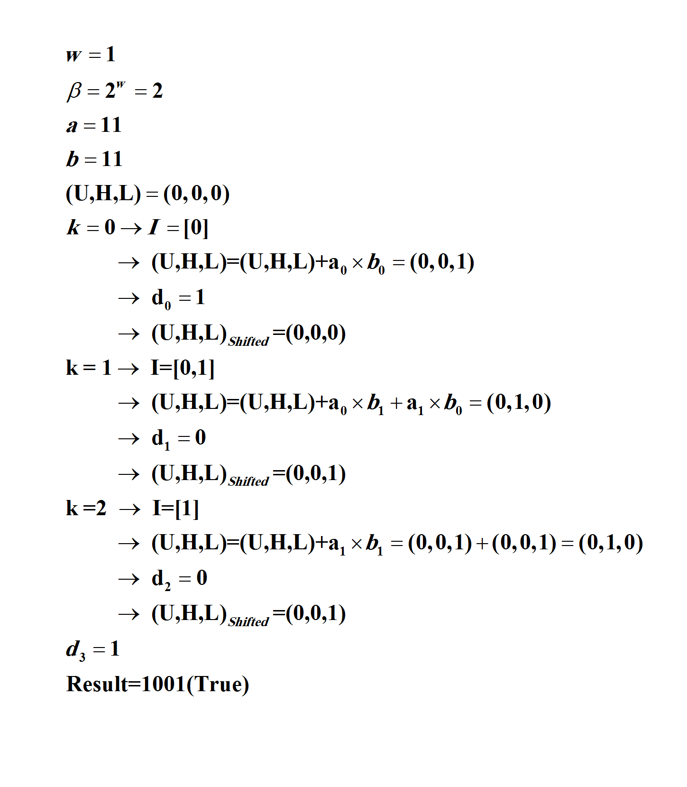
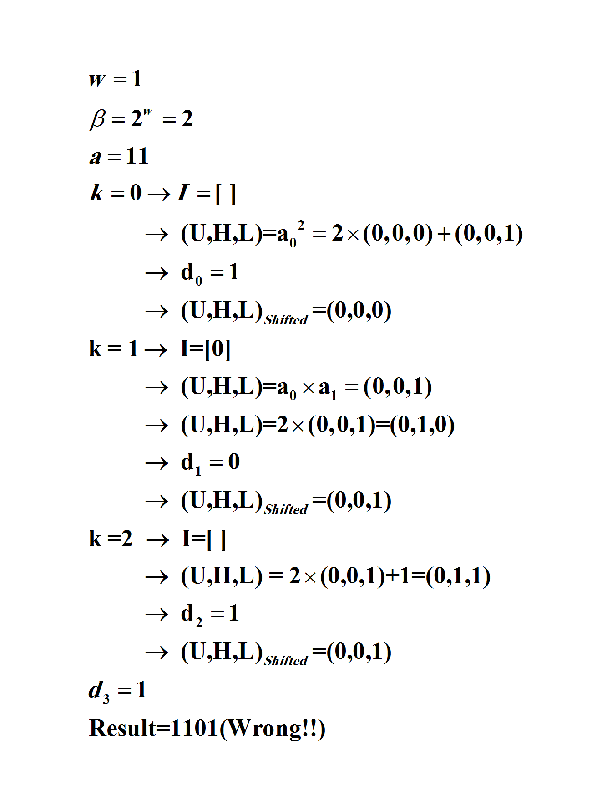
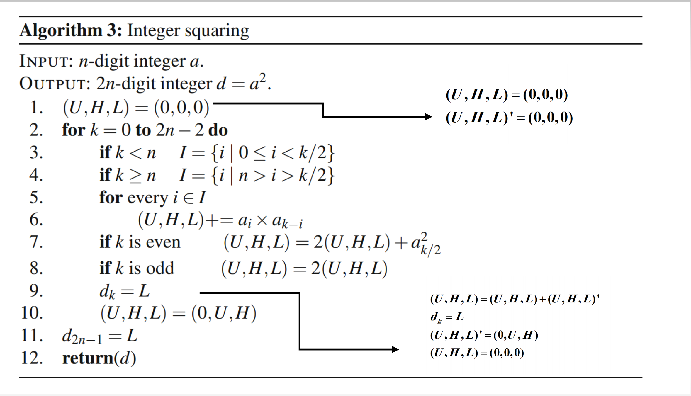
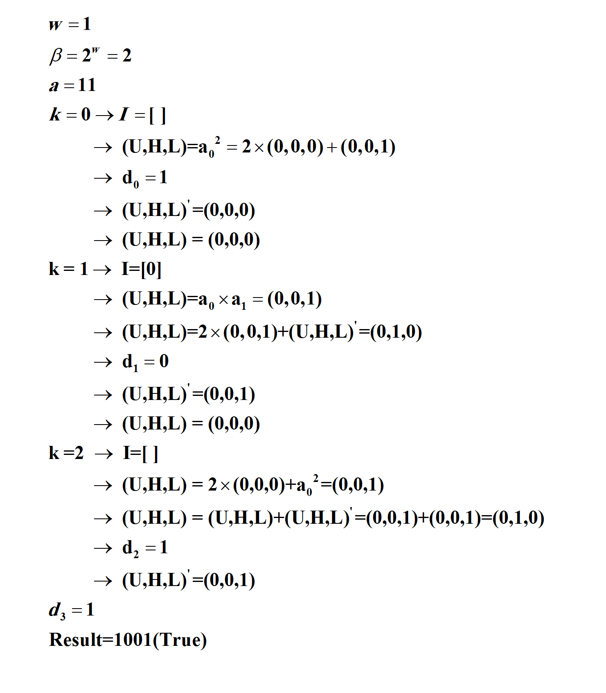

# Integer Squaring & Integer Multiplication (by product scanning) Algorithm #

### Sepand Haghighi & Mohammad Abassi

### Cryptographic Engineering Course Seminar At [Sharif University Of Technology](http://www.sharif.ir/ "Sharif University Of Technology") (Winter 2017)
### Instructor : [Dr.Siavash Bayat-Sarmadi](http://sharif.edu/~sbayat/ "http://sharif.edu/~sbayat/")
### Book : Cryptographic Engineering (Serdar S¨ uer Erdem, Tuˇ grul Yanık, and C ¸ etin Kaya Koc)	 
[](https://travis-ci.org/sepandhaghighi/Integer-Squaring)
[](https://www.codacy.com/app/sepand-haghighi/Integer-Squaring?utm_source=github.com&amp;utm_medium=referral&amp;utm_content=sepandhaghighi/Integer-Squaring&amp;utm_campaign=Badge_Grade)

[Download Slides](files/Slides.pdf "Slides") (Format : PDF, Size : 1.1 MB)

----------
# Integer Multiplication
							
### Chapter : 5					
				
### Page : 79				


<div align="center">


<p>Fig1.Algorithm-2 Pseudocode</p>

<p>Fig2.Algorithm-2 Example</p>

</div> 

```
>>> IntegerMultiplication("1 1","1 1",Base=2)
>>> 1 0 0 1 
```
Complexity : `3` additions, `2` data read (Inner Loop)


# Integer Squaring
### Book : Cryptographic Engineering (Serdar S¨ uer Erdem, Tuˇ grul Yanık, and C ¸ etin Kaya Koc)				
				
### Chapter : 5					
				
### Page : 80				


<div align="center">


<p>Fig3.Algorithm-3 Pseudocode</p>

<p>Fig4.Algorithm-3 Example</p>
</div>

* It seems this algorithm is wrong and `(U,H,L)` should be set to zero after each iteration and add shifted `(U,H,L)` outside of the loop (modified in code)
									
```
>>> IntegerSquaring("1 1","1 1",Base=2)
>>> 1 1 0 1 
```
<div align="center">

<p>Fig5.Algorithm-3(Modified) Pseudocode</p>

<p>Fig6.Algorithm-3(Modified) Example</p>


</div> 

```
>>> IntegerSquaringModified("1 1",Base=2)
>>> 1 0 0 1 
```
Complexity : `3` additions, `2` data read (Inner Loop)

# Run

1. Run `main.py` for automatic doctest --> `python main.py` or `python3 main.py`
2. Import `IntegerSquaring` and `IntegerMultiplication` and `IntegerSquaringModified` from `main.py` :
```
>>> from main import IntegerSquaring,IntegerMultiplication,IntegerSquaringModified
>>> IntegerSquaring("1 6",Base=10)
'3 8 6'
>>> IntegerSquaringModified("1 6",Base=10)
'2 5 6'
>>> IntegerMultiplication("1 6","1 6",Base=10)
'2 5 6'
```

* Enter digits with one space, for example : `31 12` in base `32`

<div align="center">

<a href="https://asciinema.org/a/155064" target="_blank"></a>

</div>

