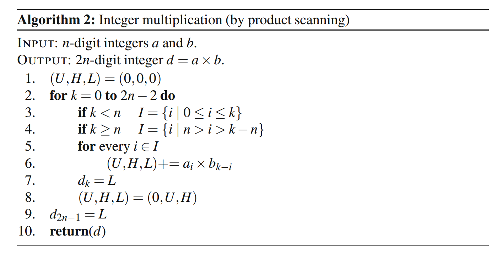
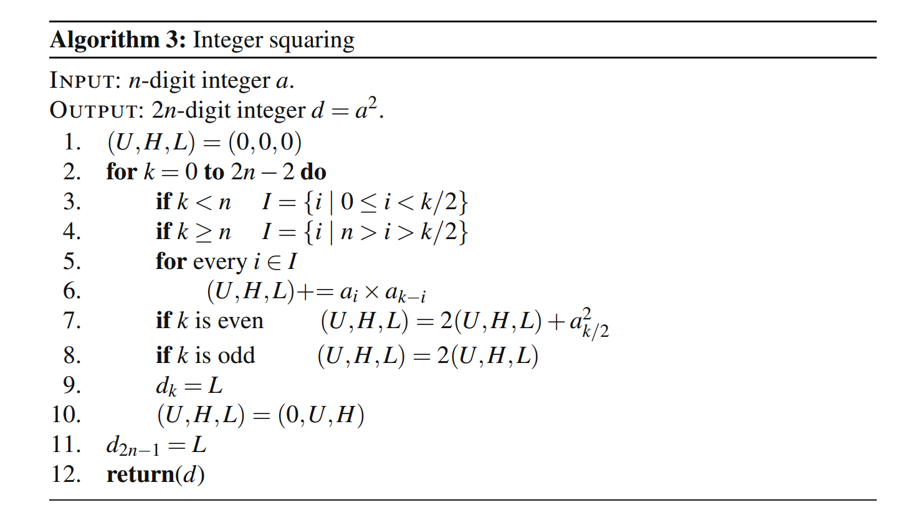

# Integer Squaring & Integer Multiplication (by product scanning) Algorithm #

### Sepand Haghighi & Mohammad Abassi

### Cryptographic Engineering Course Seminar At [Sharif University Of Technology](http://www.sharif.ir/ "Sharif University Of Technology") 
### Book : Cryptographic Engineering (Serdar S¨ uer Erdem, Tuˇ grul Yanık, and C ¸ etin Kaya Koc)	 

----------
# Integer Multiplication
							
### Chapter : 5					
				
### Page : 79				

 

# Integer Squaring
### Book : Cryptographic Engineering (Serdar S¨ uer Erdem, Tuˇ grul Yanık, and C ¸ etin Kaya Koc)				
				
### Chapter : 5					
				
### Page : 80				

 

* It seems this algorithm is wrong and `(U,H,L)` should be set to zero after each iteration and add shifted `(U,H,L)` outside of the loop (modified in code)